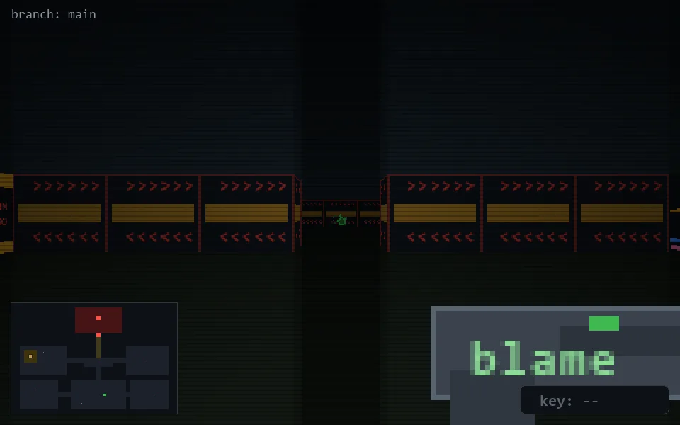

<!-- node:x21y21E -->
### `branch: main` · 📍 (21, 21) · facing E · 🔑 —

|      |      |      |
|:----:|:----:|:----:|
|      | [⬆️](x22y21E.md) |      |
| [⬅️](x21y21N.md) | [💥](x21y21E.md) | [➡️](x21y21S.md) |
|      | [⬇️](x20y21E.md) |      |

[⌂ index](../README.md)
