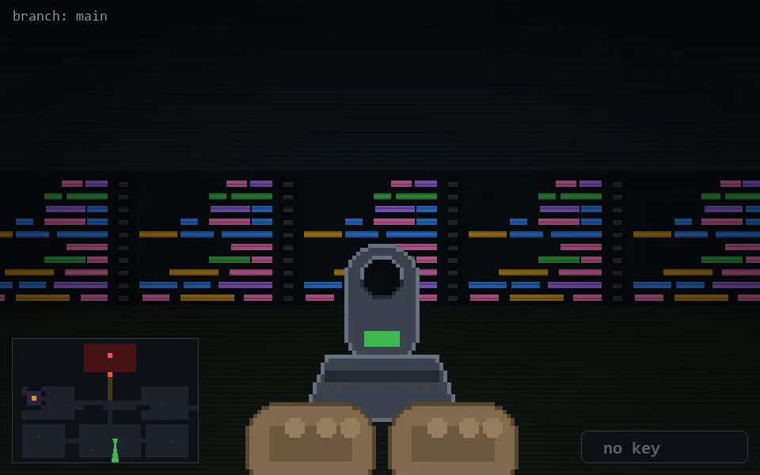

<!-- node:x21y21Sd -->
### `branch: main` · 📍 (21, 21) · facing S · 🔑 — · ✖ bug deleted (it will be back)

|      |      |      |
|:----:|:----:|:----:|
|      | [⬆️](x21y22Sd.md) |      |
| [⬅️](x21y21Ed.md) | [💥](x21y21Sd.md) | [➡️](x21y21Wd.md) |
|      | [⬇️](x21y20Sd.md) |      |

[⌂ index](../README.md)
