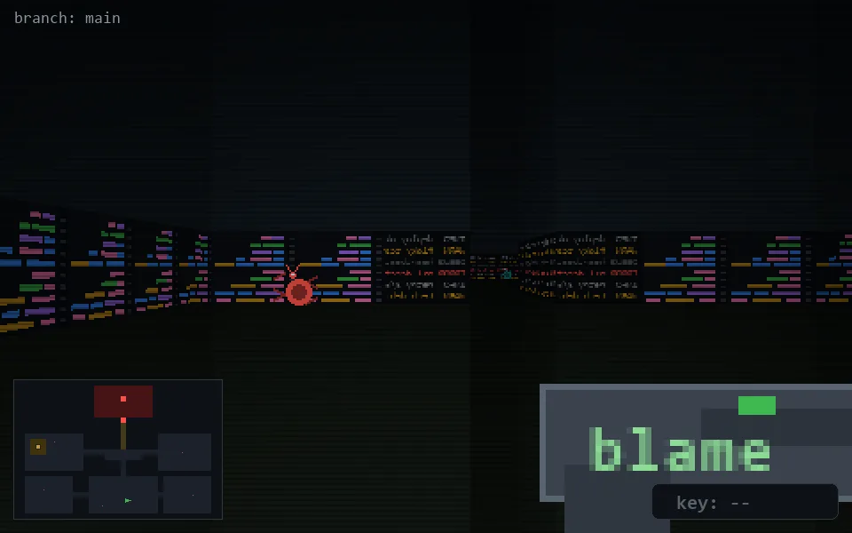

<!-- node:x21y22W -->
### `branch: main` · 📍 (21, 22) · facing W · 🔑 —

|      |      |      |
|:----:|:----:|:----:|
|      | [⬆️](x20y22W.md) |      |
| [⬅️](x21y22S.md) | [💥](x21y22Wd.md) | [➡️](x21y22N.md) |
|      | [⬇️](x22y22W.md) |      |

[⌂ index](../README.md)
