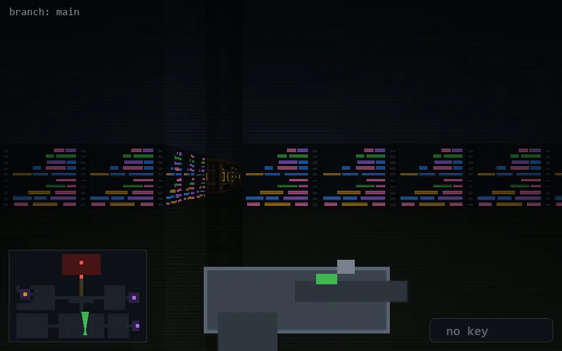

<!-- node:x21y23N -->
### `branch: main` · 📍 (21, 23) · facing N · 🔑 —

|      |      |      |
|:----:|:----:|:----:|
|      | [⬆️](x21y22N.md) |      |
| [⬅️](x21y23W.md) | [💥](x21y23N.md) | [➡️](x21y23E.md) |
|      | [⬇️](x21y24N.md) |      |

[⌂ index](../README.md)
