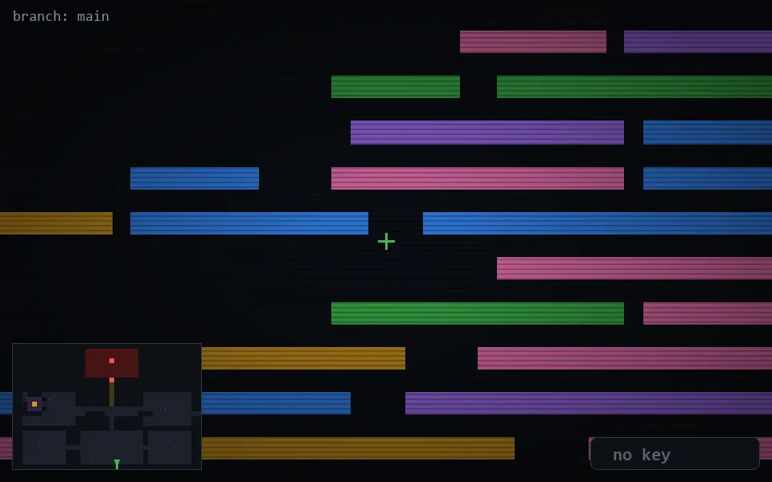

<!-- node:x21y24S -->
### `branch: main` · 📍 (21, 24) · facing S · 🔑 —

|      |      |      |
|:----:|:----:|:----:|
|      | ⛔️ |      |
| [⬅️](x21y24E.md) | [💥](x21y24S.md) | [➡️](x21y24W.md) |
|      | [⬇️](x21y23S.md) |      |

[⌂ index](../README.md)
