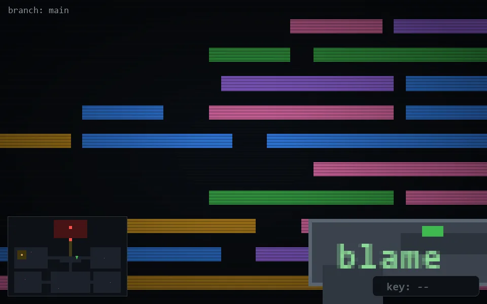

<!-- node:x22y13N -->
### `branch: main` · 📍 (22, 13) · facing N · 🔑 —

|      |      |      |
|:----:|:----:|:----:|
|      | ⛔️ |      |
| [⬅️](x22y13W.md) | [💥](x22y13Nd.md) | [➡️](x22y13E.md) |
|      | [⬇️](x22y14N.md) |      |

[⌂ index](../README.md)
