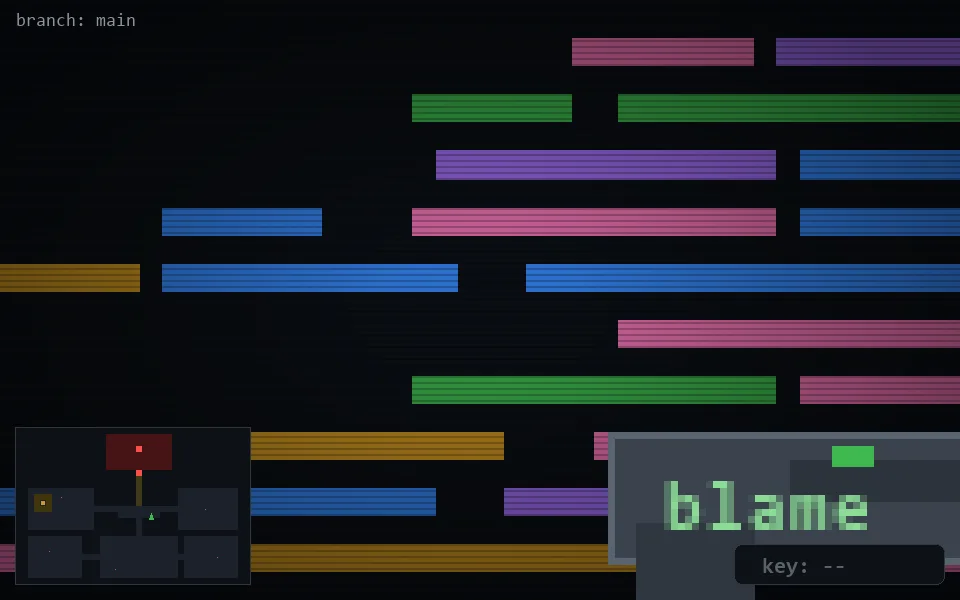

<!-- node:x22y14S -->
### `branch: main` · 📍 (22, 14) · facing S · 🔑 —

|      |      |      |
|:----:|:----:|:----:|
|      | ⛔️ |      |
| [⬅️](x22y14E.md) | [💥](x22y14Sd.md) | [➡️](x22y14W.md) |
|      | [⬇️](x22y13S.md) |      |

[⌂ index](../README.md)
