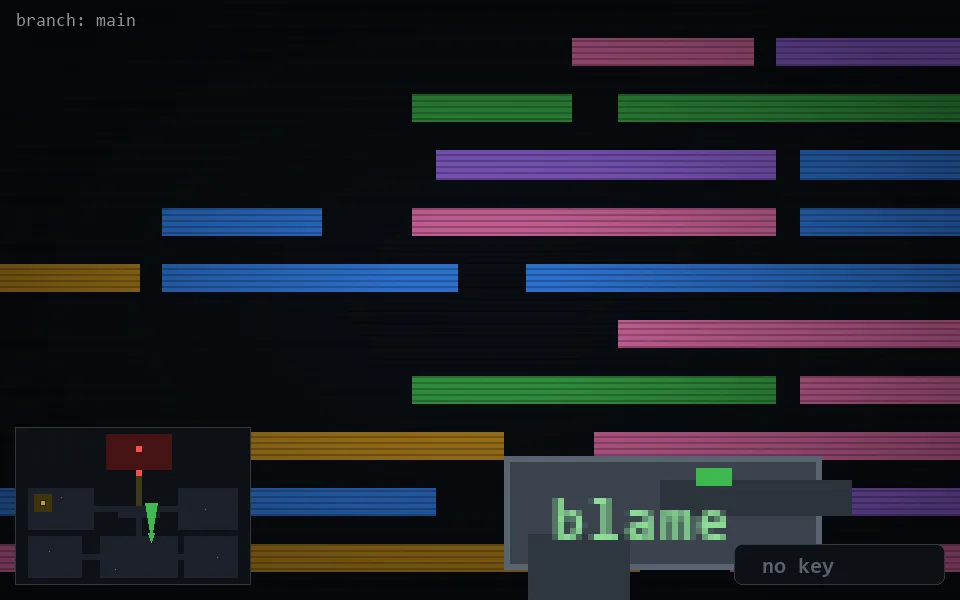

<!-- node:x22y18N -->
### `branch: main` · 📍 (22, 18) · facing N · 🔑 —

|      |      |      |
|:----:|:----:|:----:|
|      | ⛔️ |      |
| [⬅️](x22y18W.md) | [💥](x22y18N.md) | [➡️](x22y18E.md) |
|      | [⬇️](x22y19N.md) |      |

[⌂ index](../README.md)
