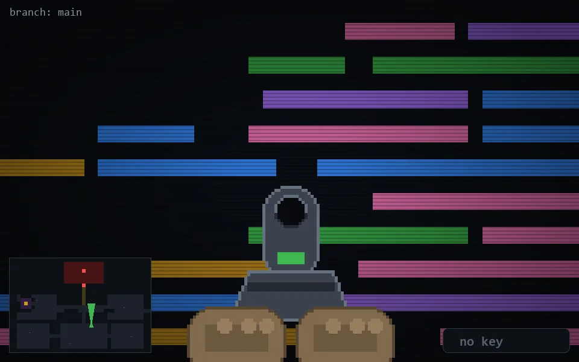

<!-- node:x22y18Nd -->
### `branch: main` · 📍 (22, 18) · facing N · 🔑 — · ✖ bug deleted (it will be back)

|      |      |      |
|:----:|:----:|:----:|
|      | ⛔️ |      |
| [⬅️](x22y18Wd.md) | [💥](x22y18Nd.md) | [➡️](x22y18Ed.md) |
|      | [⬇️](x22y19Nd.md) |      |

[⌂ index](../README.md)
