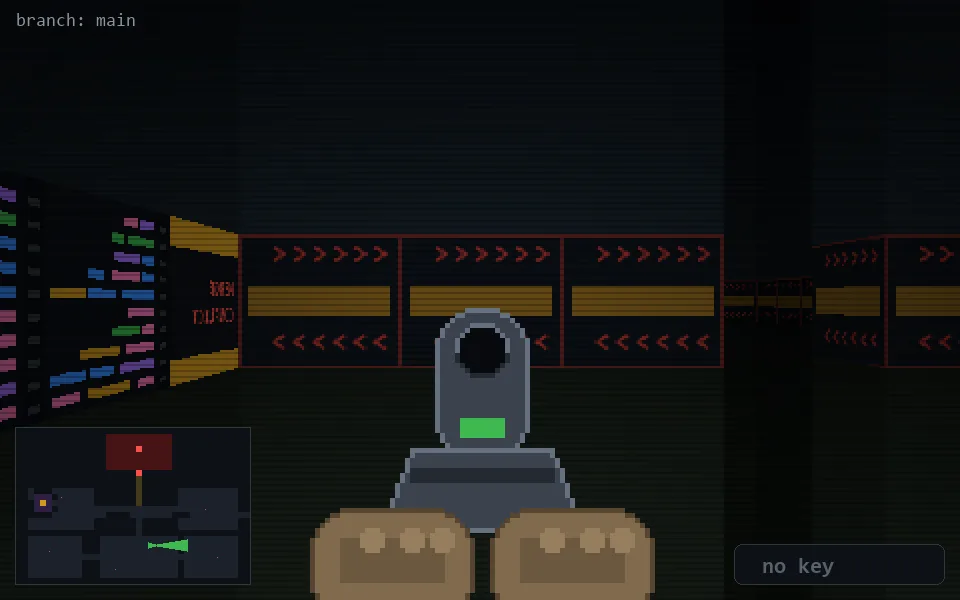

<!-- node:x22y19Ed -->
### `branch: main` · 📍 (22, 19) · facing E · 🔑 — · ✖ bug deleted (it will be back)

|      |      |      |
|:----:|:----:|:----:|
|      | [⬆️](x23y19Ed.md) |      |
| [⬅️](x22y19Nd.md) | [💥](x22y19Ed.md) | [➡️](x22y19Sd.md) |
|      | [⬇️](x21y19Ed.md) |      |

[⌂ index](../README.md)
