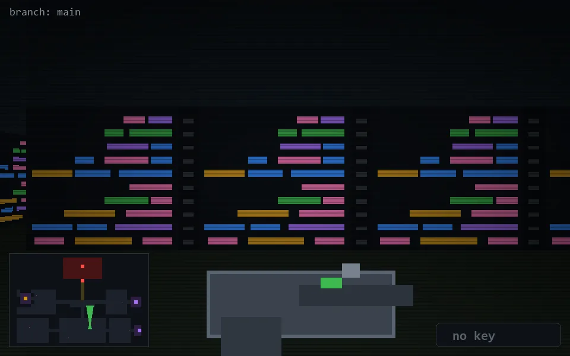

<!-- node:x22y20N -->
### `branch: main` · 📍 (22, 20) · facing N · 🔑 —

|      |      |      |
|:----:|:----:|:----:|
|      | [⬆️](x22y19N.md) |      |
| [⬅️](x22y20W.md) | [💥](x22y20N.md) | [➡️](x22y20E.md) |
|      | [⬇️](x22y21N.md) |      |

[⌂ index](../README.md)
