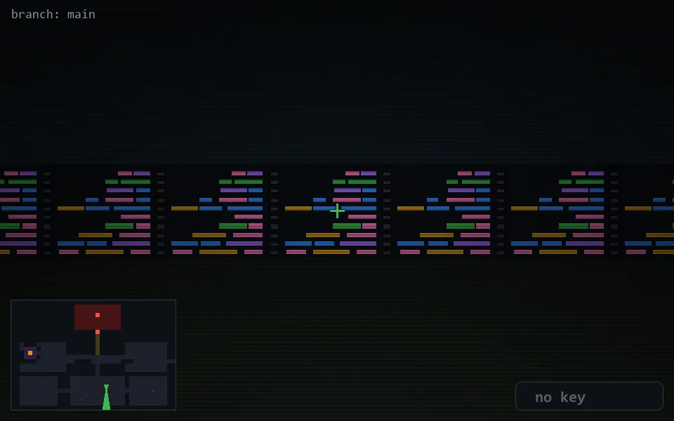

<!-- node:x22y20S -->
### `branch: main` · 📍 (22, 20) · facing S · 🔑 —

|      |      |      |
|:----:|:----:|:----:|
|      | [⬆️](x22y21S.md) |      |
| [⬅️](x22y20E.md) | [💥](x22y20Sd.md) | [➡️](x22y20W.md) |
|      | [⬇️](x22y19S.md) |      |

[⌂ index](../README.md)
