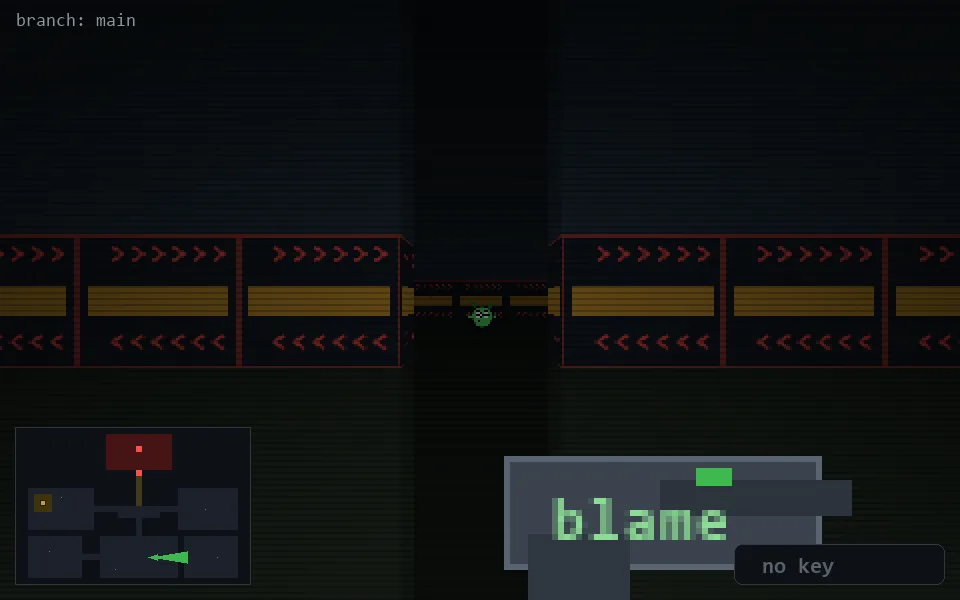

<!-- node:x22y21E -->
### `branch: main` · 📍 (22, 21) · facing E · 🔑 —

|      |      |      |
|:----:|:----:|:----:|
|      | [⬆️](x23y21E.md) |      |
| [⬅️](x22y21N.md) | [💥](x22y21E.md) | [➡️](x22y21S.md) |
|      | [⬇️](x21y21E.md) |      |

[⌂ index](../README.md)
