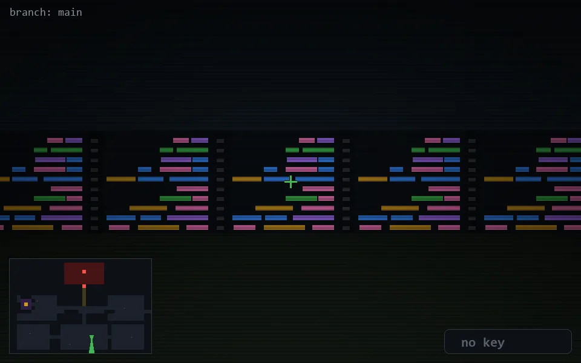

<!-- node:x22y21Sd -->
### `branch: main` · 📍 (22, 21) · facing S · 🔑 — · ✖ bug deleted (it will be back)

|      |      |      |
|:----:|:----:|:----:|
|      | [⬆️](x22y22Sd.md) |      |
| [⬅️](x22y21Ed.md) | [💥](x22y21Sd.md) | [➡️](x22y21Wd.md) |
|      | [⬇️](x22y20Sd.md) |      |

[⌂ index](../README.md)
