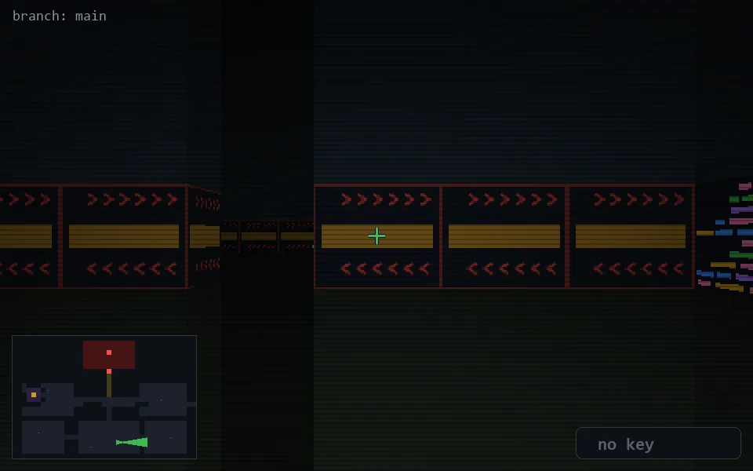

<!-- node:x22y22E -->
### `branch: main` · 📍 (22, 22) · facing E · 🔑 —

|      |      |      |
|:----:|:----:|:----:|
|      | [⬆️](x23y22E.md) |      |
| [⬅️](x22y22N.md) | [💥](x22y22E.md) | [➡️](x22y22S.md) |
|      | [⬇️](x21y22E.md) |      |

[⌂ index](../README.md)
