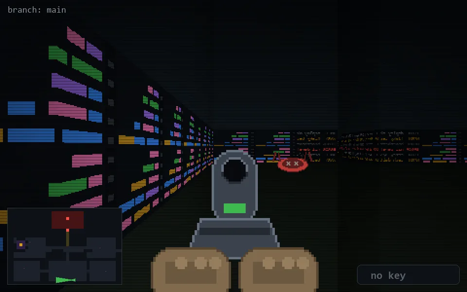

<!-- node:x22y24Wd -->
### `branch: main` · 📍 (22, 24) · facing W · 🔑 — · ✖ bug deleted (it will be back)

|      |      |      |
|:----:|:----:|:----:|
|      | [⬆️](x21y24Wd.md) |      |
| [⬅️](x22y24Sd.md) | [💥](x22y24Wd.md) | [➡️](x22y24Nd.md) |
|      | [⬇️](x23y24Wd.md) |      |

[⌂ index](../README.md)
