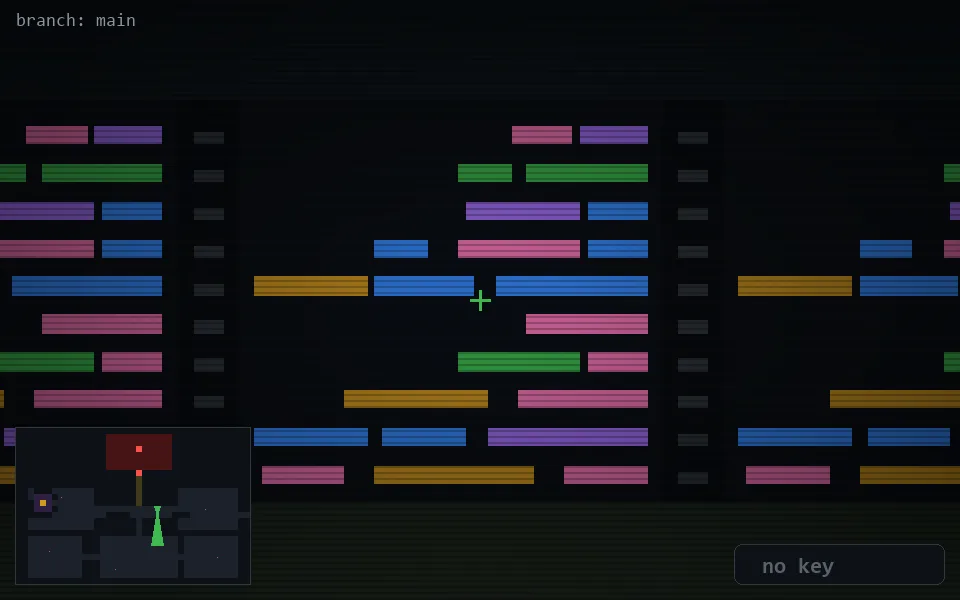

<!-- node:x23y13Sd -->
### `branch: main` · 📍 (23, 13) · facing S · 🔑 — · ✖ bug deleted (it will be back)

|      |      |      |
|:----:|:----:|:----:|
|      | [⬆️](x23y14Sd.md) |      |
| [⬅️](x23y13Ed.md) | [💥](x23y13Sd.md) | [➡️](x23y13Wd.md) |
|      | ⛔️ |      |

[⌂ index](../README.md)
