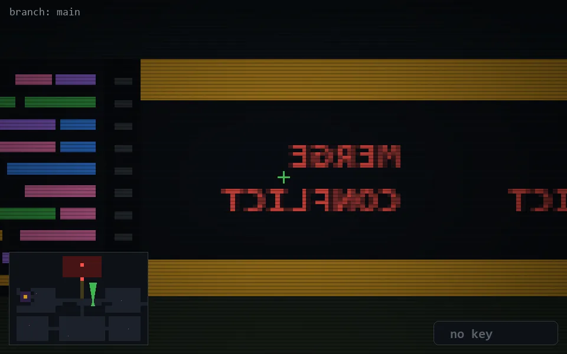

<!-- node:x23y14N -->
### `branch: main` · 📍 (23, 14) · facing N · 🔑 —

|      |      |      |
|:----:|:----:|:----:|
|      | [⬆️](x23y13N.md) |      |
| [⬅️](x23y14W.md) | [💥](x23y14Nd.md) | [➡️](x23y14E.md) |
|      | ⛔️ |      |

[⌂ index](../README.md)
