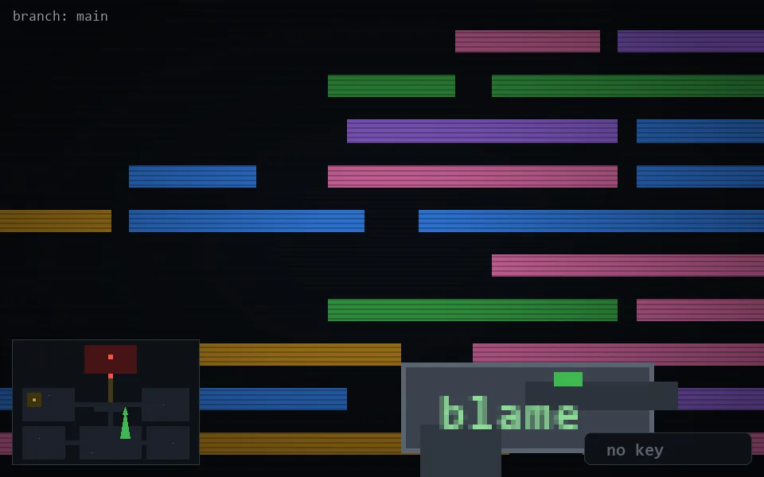

<!-- node:x23y14S -->
### `branch: main` · 📍 (23, 14) · facing S · 🔑 —

|      |      |      |
|:----:|:----:|:----:|
|      | ⛔️ |      |
| [⬅️](x23y14E.md) | [💥](x23y14Sd.md) | [➡️](x23y14W.md) |
|      | [⬇️](x23y13S.md) |      |

[⌂ index](../README.md)
