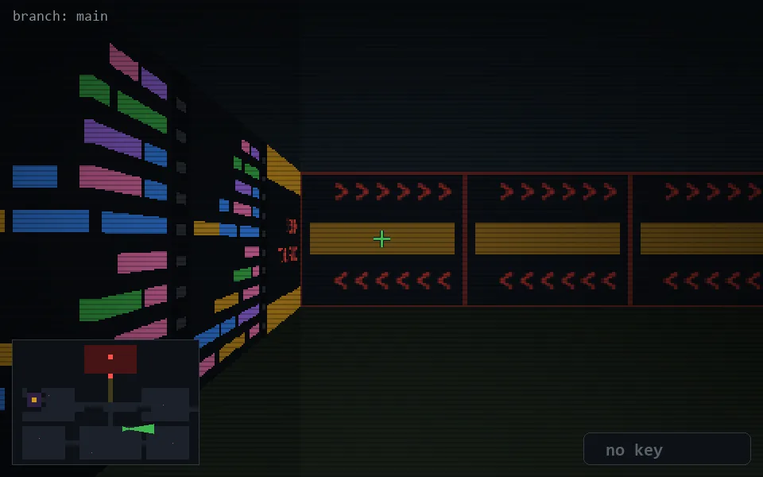

<!-- node:x23y18Ed -->
### `branch: main` · 📍 (23, 18) · facing E · 🔑 — · ✖ bug deleted (it will be back)

|      |      |      |
|:----:|:----:|:----:|
|      | [⬆️](x24y18Ed.md) |      |
| [⬅️](x23y18Nd.md) | [💥](x23y18Ed.md) | [➡️](x23y18Sd.md) |
|      | [⬇️](x22y18Ed.md) |      |

[⌂ index](../README.md)
