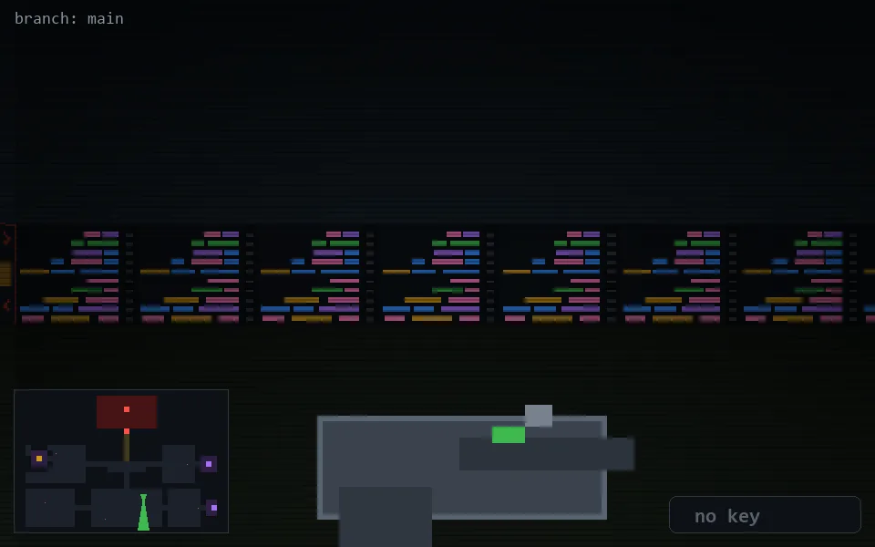

<!-- node:x23y19S -->
### `branch: main` · 📍 (23, 19) · facing S · 🔑 —

|      |      |      |
|:----:|:----:|:----:|
|      | [⬆️](x23y20S.md) |      |
| [⬅️](x23y19E.md) | [💥](x23y19S.md) | [➡️](x23y19W.md) |
|      | [⬇️](x23y18S.md) |      |

[⌂ index](../README.md)
