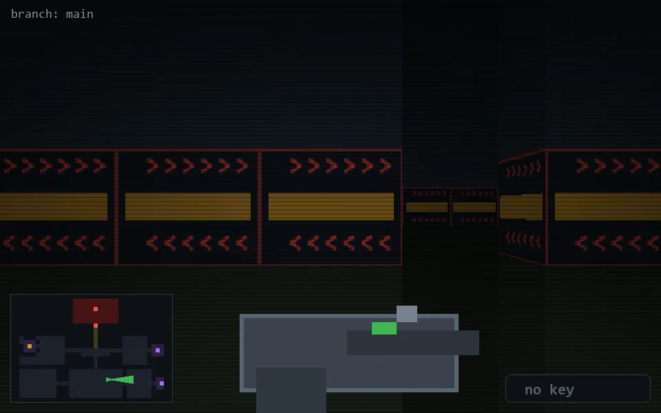

<!-- node:x23y20E -->
### `branch: main` · 📍 (23, 20) · facing E · 🔑 —

|      |      |      |
|:----:|:----:|:----:|
|      | [⬆️](x24y20E.md) |      |
| [⬅️](x23y20N.md) | [💥](x23y20E.md) | [➡️](x23y20S.md) |
|      | [⬇️](x22y20E.md) |      |

[⌂ index](../README.md)
