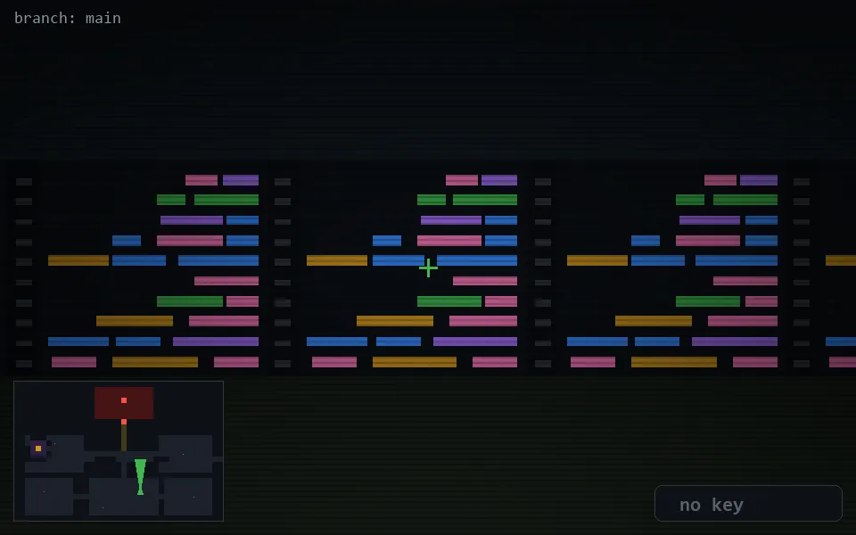

<!-- node:x23y20N -->
### `branch: main` · 📍 (23, 20) · facing N · 🔑 —

|      |      |      |
|:----:|:----:|:----:|
|      | [⬆️](x23y19N.md) |      |
| [⬅️](x23y20W.md) | [💥](x23y20N.md) | [➡️](x23y20E.md) |
|      | [⬇️](x23y21N.md) |      |

[⌂ index](../README.md)
