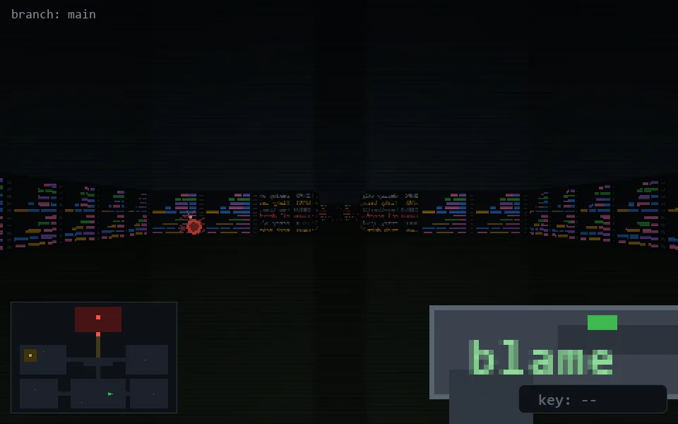

<!-- node:x23y21W -->
### `branch: main` · 📍 (23, 21) · facing W · 🔑 —

|      |      |      |
|:----:|:----:|:----:|
|      | [⬆️](x22y21W.md) |      |
| [⬅️](x23y21S.md) | [💥](x23y21Wd.md) | [➡️](x23y21N.md) |
|      | [⬇️](x24y21W.md) |      |

[⌂ index](../README.md)
