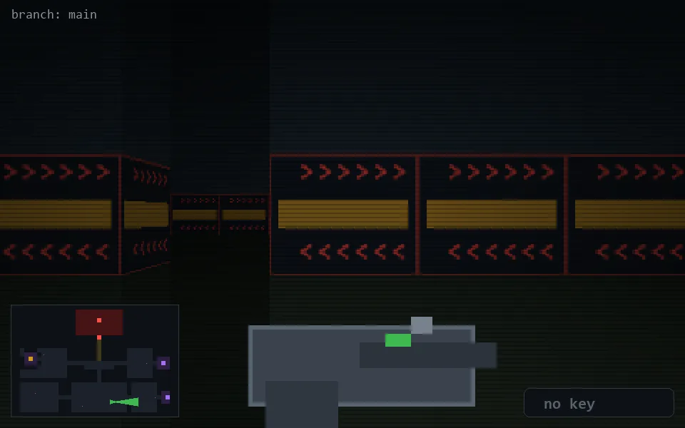

<!-- node:x23y22E -->
### `branch: main` · 📍 (23, 22) · facing E · 🔑 —

|      |      |      |
|:----:|:----:|:----:|
|      | [⬆️](x24y22E.md) |      |
| [⬅️](x23y22N.md) | [💥](x23y22Ed.md) | [➡️](x23y22S.md) |
|      | [⬇️](x22y22E.md) |      |

[⌂ index](../README.md)
