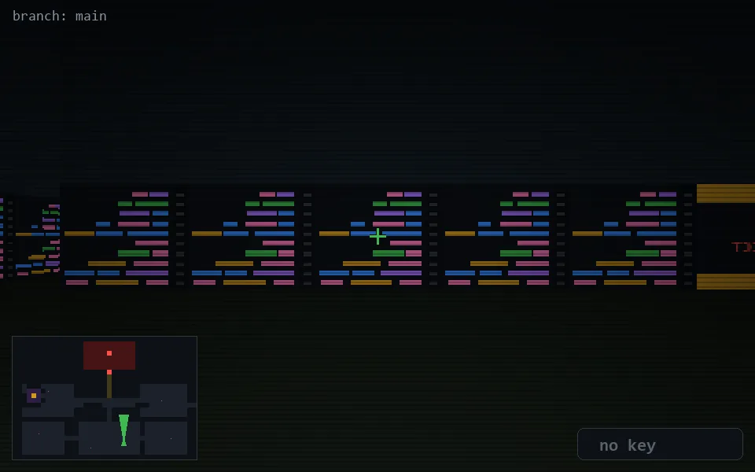

<!-- node:x23y22Nd -->
### `branch: main` · 📍 (23, 22) · facing N · 🔑 — · ✖ bug deleted (it will be back)

|      |      |      |
|:----:|:----:|:----:|
|      | [⬆️](x23y21Nd.md) |      |
| [⬅️](x23y22Wd.md) | [💥](x23y22Nd.md) | [➡️](x23y22Ed.md) |
|      | [⬇️](x23y23Nd.md) |      |

[⌂ index](../README.md)
