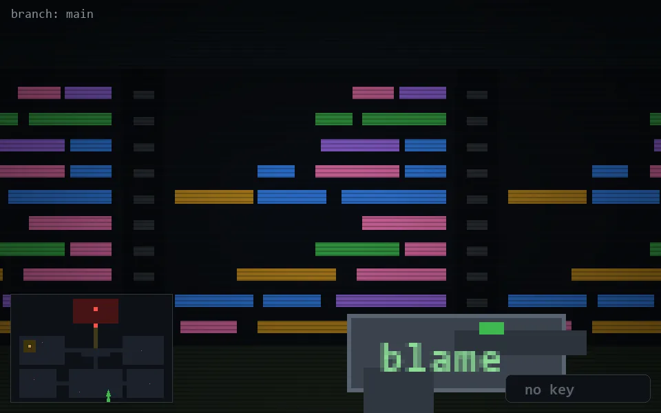

<!-- node:x23y23S -->
### `branch: main` · 📍 (23, 23) · facing S · 🔑 —

|      |      |      |
|:----:|:----:|:----:|
|      | [⬆️](x23y24S.md) |      |
| [⬅️](x23y23E.md) | [💥](x23y23Sd.md) | [➡️](x23y23W.md) |
|      | [⬇️](x23y22S.md) |      |

[⌂ index](../README.md)
