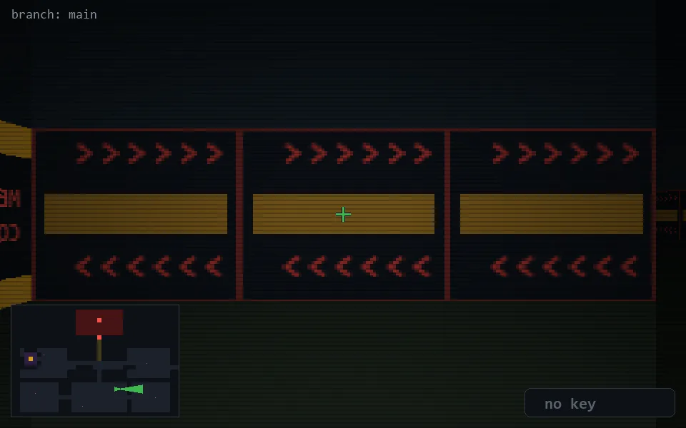

<!-- node:x24y19Ed -->
### `branch: main` · 📍 (24, 19) · facing E · 🔑 — · ✖ bug deleted (it will be back)

|      |      |      |
|:----:|:----:|:----:|
|      | [⬆️](x25y19Ed.md) |      |
| [⬅️](x24y19Nd.md) | [💥](x24y19Ed.md) | [➡️](x24y19Sd.md) |
|      | [⬇️](x23y19Ed.md) |      |

[⌂ index](../README.md)
