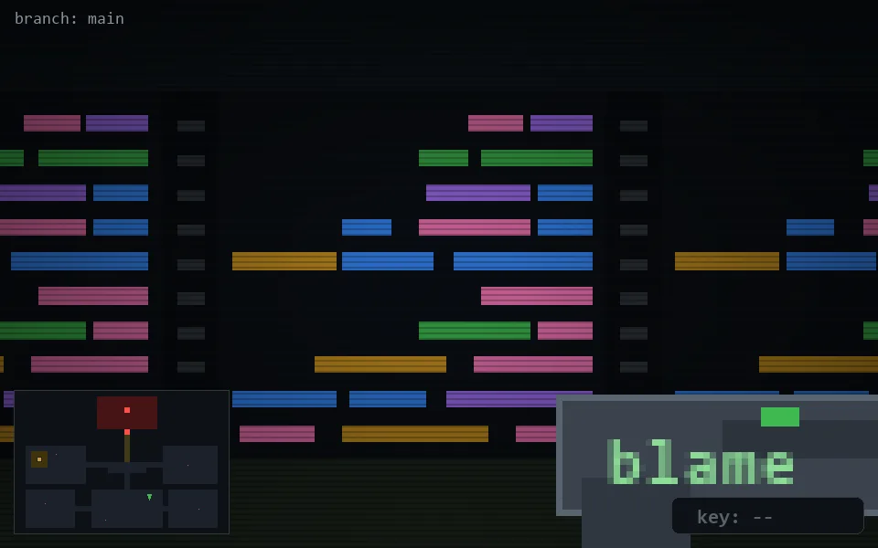

<!-- node:x24y19N -->
### `branch: main` · 📍 (24, 19) · facing N · 🔑 —

|      |      |      |
|:----:|:----:|:----:|
|      | [⬆️](x24y18N.md) |      |
| [⬅️](x24y19W.md) | [💥](x24y19Nd.md) | [➡️](x24y19E.md) |
|      | [⬇️](x24y20N.md) |      |

[⌂ index](../README.md)
