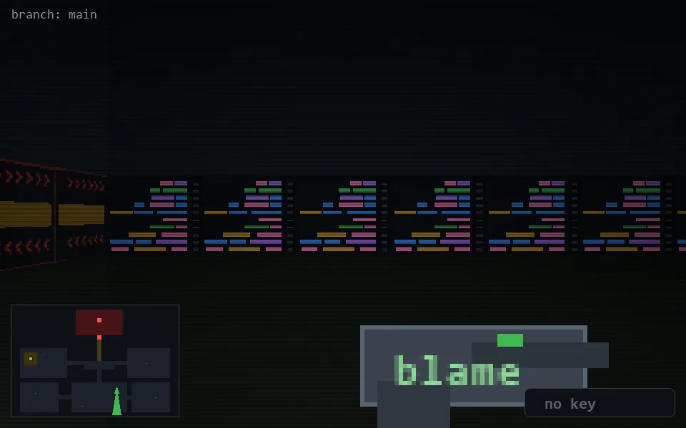

<!-- node:x24y19S -->
### `branch: main` · 📍 (24, 19) · facing S · 🔑 —

|      |      |      |
|:----:|:----:|:----:|
|      | [⬆️](x24y20S.md) |      |
| [⬅️](x24y19E.md) | [💥](x24y19Sd.md) | [➡️](x24y19W.md) |
|      | [⬇️](x24y18S.md) |      |

[⌂ index](../README.md)
