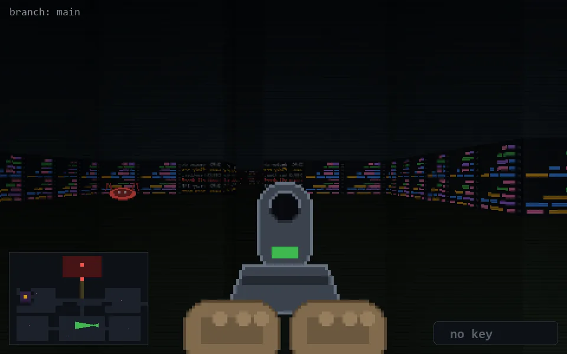

<!-- node:x24y20Wd -->
### `branch: main` · 📍 (24, 20) · facing W · 🔑 — · ✖ bug deleted (it will be back)

|      |      |      |
|:----:|:----:|:----:|
|      | [⬆️](x23y20Wd.md) |      |
| [⬅️](x24y20Sd.md) | [💥](x24y20Wd.md) | [➡️](x24y20Nd.md) |
|      | [⬇️](x25y20Wd.md) |      |

[⌂ index](../README.md)
