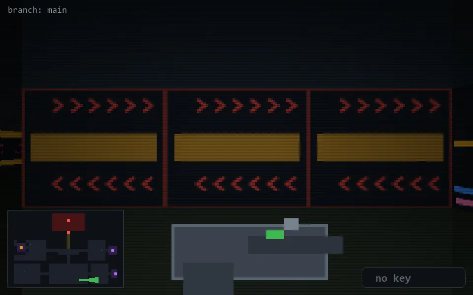

<!-- node:x24y23E -->
### `branch: main` · 📍 (24, 23) · facing E · 🔑 —

|      |      |      |
|:----:|:----:|:----:|
|      | [⬆️](x25y23E.md) |      |
| [⬅️](x24y23N.md) | [💥](x24y23Ed.md) | [➡️](x24y23S.md) |
|      | [⬇️](x23y23E.md) |      |

[⌂ index](../README.md)
