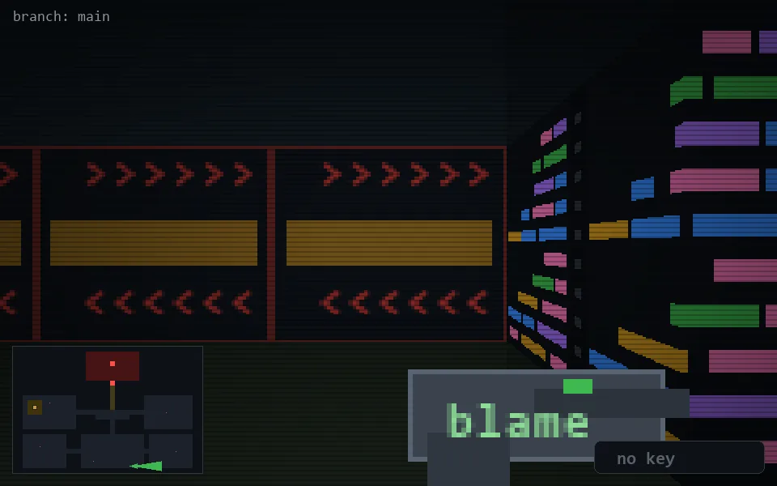

<!-- node:x24y24E -->
### `branch: main` · 📍 (24, 24) · facing E · 🔑 —

|      |      |      |
|:----:|:----:|:----:|
|      | [⬆️](x25y24E.md) |      |
| [⬅️](x24y24N.md) | [💥](x24y24Ed.md) | [➡️](x24y24S.md) |
|      | [⬇️](x23y24E.md) |      |

[⌂ index](../README.md)
