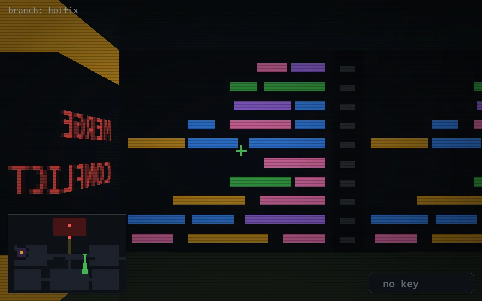

<!-- node:x25y13S -->
### `branch: hotfix` · 📍 (25, 13) · facing S · 🔑 —

|      |      |      |
|:----:|:----:|:----:|
|      | [⬆️](x25y14S.md) |      |
| [⬅️](x25y13E.md) | [💥](x25y13S.md) | [➡️](x25y13W.md) |
|      | ⛔️ |      |

[⌂ index](../README.md)
