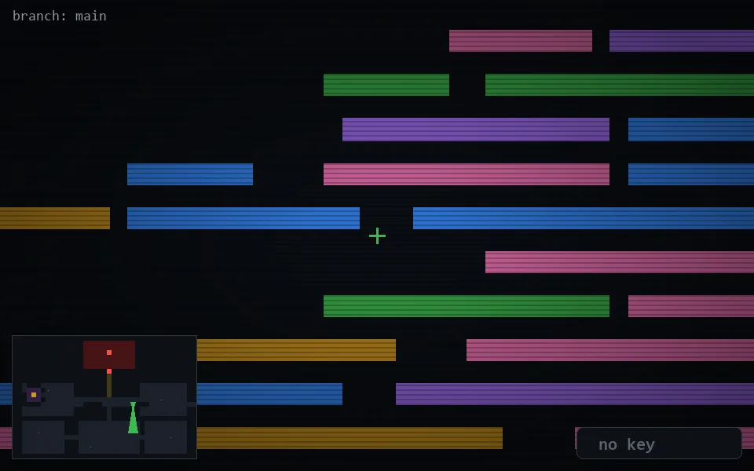

<!-- node:x25y14Sd -->
### `branch: main` · 📍 (25, 14) · facing S · 🔑 — · ✖ bug deleted (it will be back)

|      |      |      |
|:----:|:----:|:----:|
|      | ⛔️ |      |
| [⬅️](x25y14Ed.md) | [💥](x25y14Sd.md) | [➡️](x25y14Wd.md) |
|      | [⬇️](x25y13S.md) |      |

[⌂ index](../README.md)
