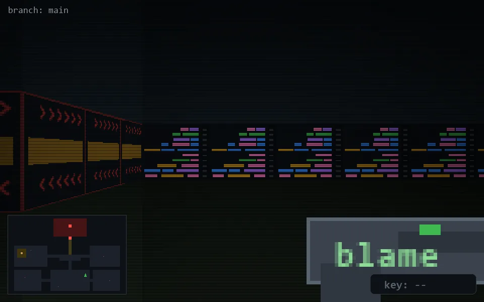

<!-- node:x25y19S -->
### `branch: main` · 📍 (25, 19) · facing S · 🔑 —

|      |      |      |
|:----:|:----:|:----:|
|      | [⬆️](x25y20S.md) |      |
| [⬅️](x25y19E.md) | [💥](x25y19S.md) | [➡️](x25y19W.md) |
|      | [⬇️](x25y18S.md) |      |

[⌂ index](../README.md)
