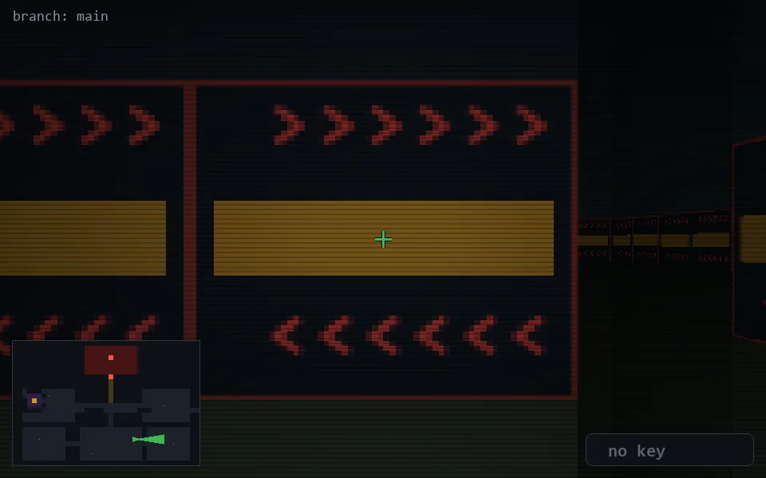

<!-- node:x25y20E -->
### `branch: main` · 📍 (25, 20) · facing E · 🔑 —

|      |      |      |
|:----:|:----:|:----:|
|      | [⬆️](x26y20E.md) |      |
| [⬅️](x25y20N.md) | [💥](x25y20E.md) | [➡️](x25y20S.md) |
|      | [⬇️](x24y20E.md) |      |

[⌂ index](../README.md)
