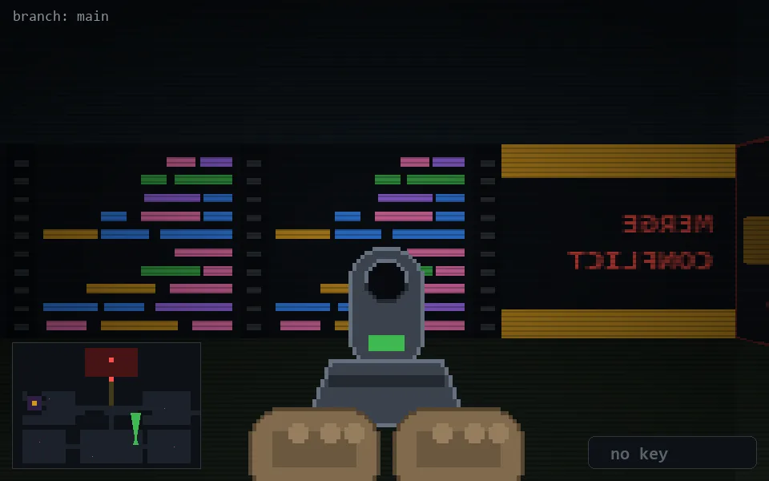

<!-- node:x25y20Nd -->
### `branch: main` · 📍 (25, 20) · facing N · 🔑 — · ✖ bug deleted (it will be back)

|      |      |      |
|:----:|:----:|:----:|
|      | [⬆️](x25y19Nd.md) |      |
| [⬅️](x25y20Wd.md) | [💥](x25y20Nd.md) | [➡️](x25y20Ed.md) |
|      | [⬇️](x25y21Nd.md) |      |

[⌂ index](../README.md)
