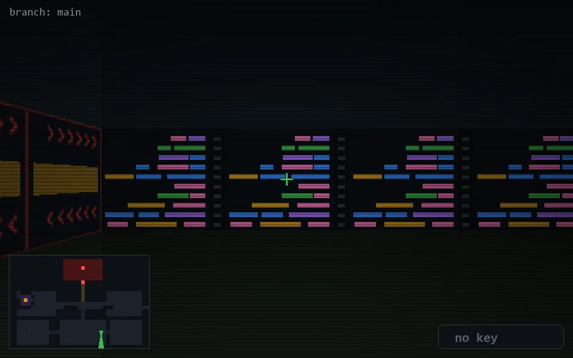

<!-- node:x25y21Sd -->
### `branch: main` · 📍 (25, 21) · facing S · 🔑 — · ✖ bug deleted (it will be back)

|      |      |      |
|:----:|:----:|:----:|
|      | [⬆️](x25y22Sd.md) |      |
| [⬅️](x25y21Ed.md) | [💥](x25y21Sd.md) | [➡️](x25y21Wd.md) |
|      | [⬇️](x25y20Sd.md) |      |

[⌂ index](../README.md)
