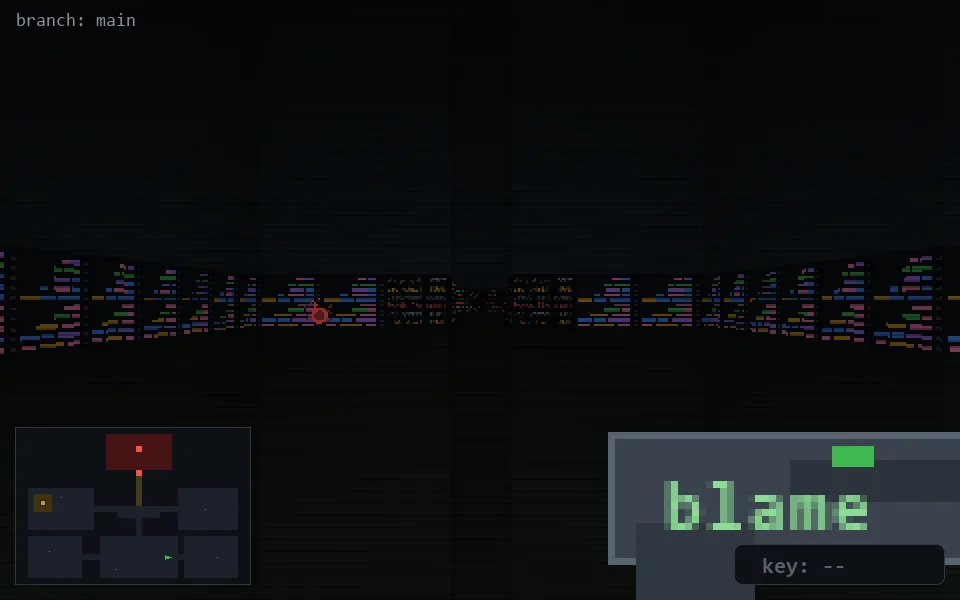

<!-- node:x25y21W -->
### `branch: main` · 📍 (25, 21) · facing W · 🔑 —

|      |      |      |
|:----:|:----:|:----:|
|      | [⬆️](x24y21W.md) |      |
| [⬅️](x25y21S.md) | [💥](x25y21Wd.md) | [➡️](x25y21N.md) |
|      | [⬇️](x26y21W.md) |      |

[⌂ index](../README.md)
