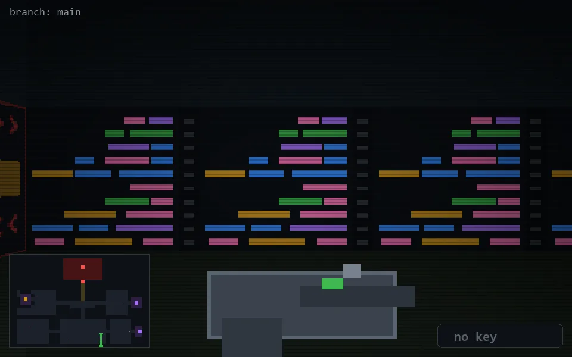

<!-- node:x25y22S -->
### `branch: main` · 📍 (25, 22) · facing S · 🔑 —

|      |      |      |
|:----:|:----:|:----:|
|      | [⬆️](x25y23S.md) |      |
| [⬅️](x25y22E.md) | [💥](x25y22S.md) | [➡️](x25y22W.md) |
|      | [⬇️](x25y21S.md) |      |

[⌂ index](../README.md)
