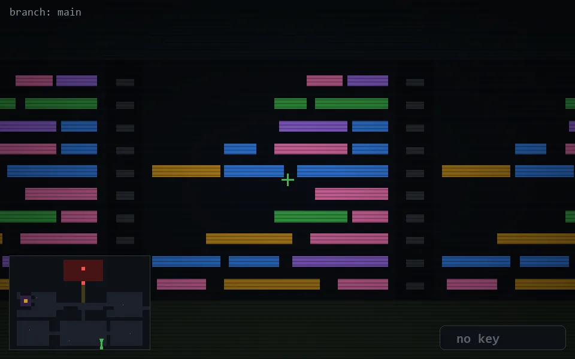

<!-- node:x25y23S -->
### `branch: main` · 📍 (25, 23) · facing S · 🔑 —

|      |      |      |
|:----:|:----:|:----:|
|      | [⬆️](x25y24S.md) |      |
| [⬅️](x25y23E.md) | [💥](x25y23S.md) | [➡️](x25y23W.md) |
|      | [⬇️](x25y22S.md) |      |

[⌂ index](../README.md)
