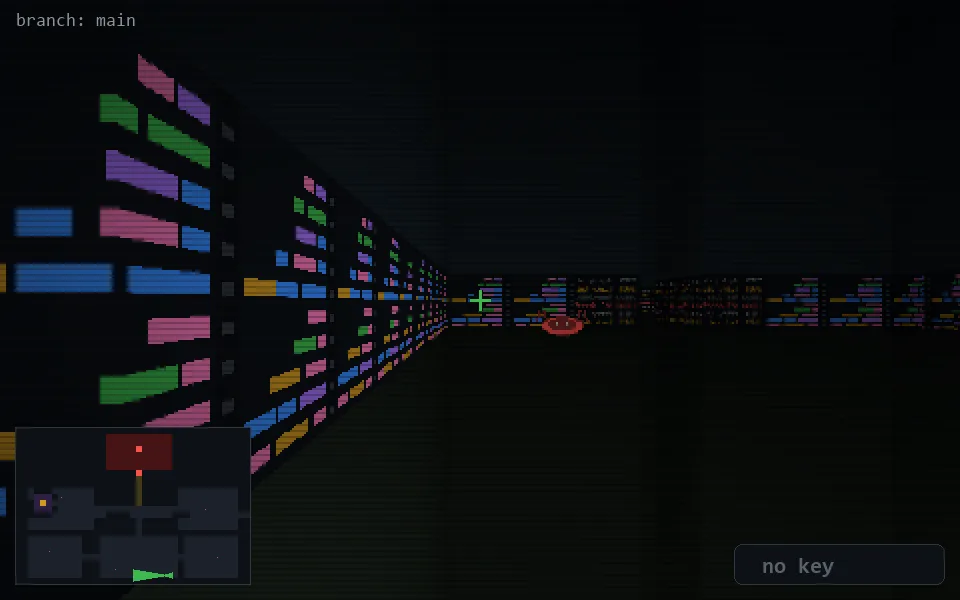

<!-- node:x25y24Wd -->
### `branch: main` · 📍 (25, 24) · facing W · 🔑 — · ✖ bug deleted (it will be back)

|      |      |      |
|:----:|:----:|:----:|
|      | [⬆️](x24y24Wd.md) |      |
| [⬅️](x25y24Sd.md) | [💥](x25y24Wd.md) | [➡️](x25y24Nd.md) |
|      | [⬇️](x26y24Wd.md) |      |

[⌂ index](../README.md)
