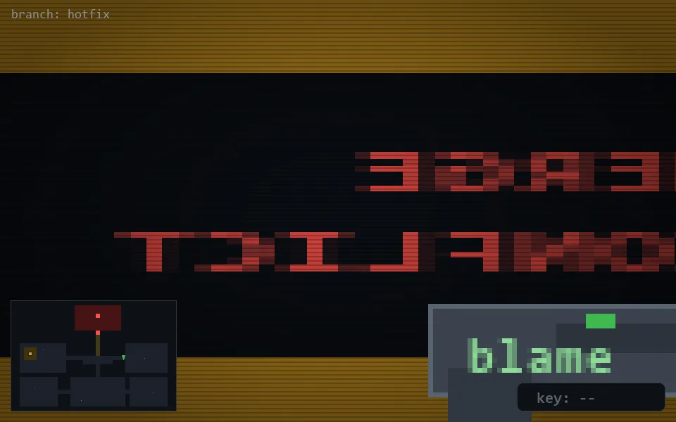

<!-- node:x26y13N -->
### `branch: hotfix` · 📍 (26, 13) · facing N · 🔑 —

|      |      |      |
|:----:|:----:|:----:|
|      | ⛔️ |      |
| [⬅️](x26y13W.md) | [💥](x26y13Nd.md) | [➡️](x26y13E.md) |
|      | ⛔️ |      |

[⌂ index](../README.md)
