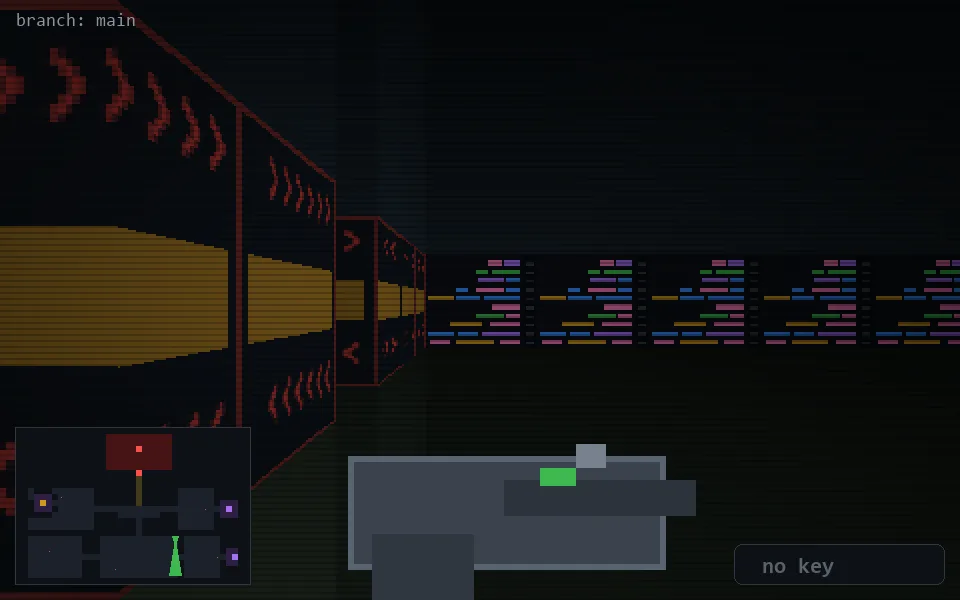

<!-- node:x26y18S -->
### `branch: main` · 📍 (26, 18) · facing S · 🔑 —

|      |      |      |
|:----:|:----:|:----:|
|      | [⬆️](x26y19S.md) |      |
| [⬅️](x26y18E.md) | [💥](x26y18S.md) | [➡️](x26y18W.md) |
|      | ⛔️ |      |

[⌂ index](../README.md)
