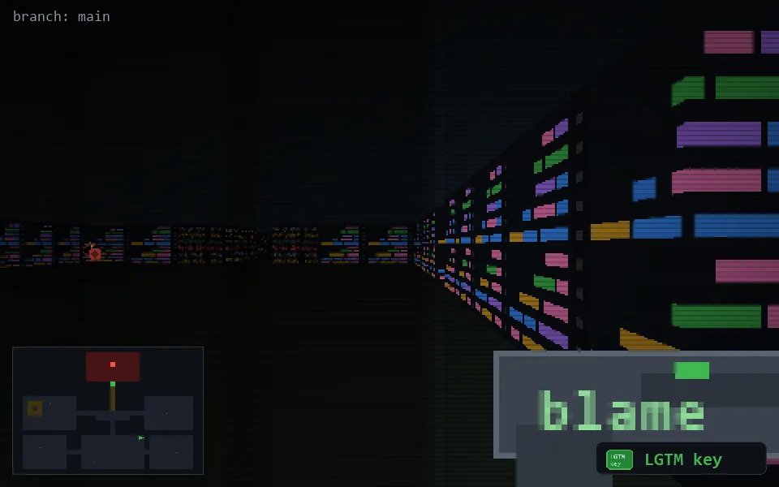

<!-- node:x26y18Wk -->
### `branch: main` · 📍 (26, 18) · facing W · 🔑 LGTM

|      |      |      |
|:----:|:----:|:----:|
|      | [⬆️](x25y18Wk.md) |      |
| [⬅️](x26y18Sk.md) | [💥](x26y18Wk.md) | [➡️](x26y18Nk.md) |
|      | ⛔️ |      |

[⌂ index](../README.md)
