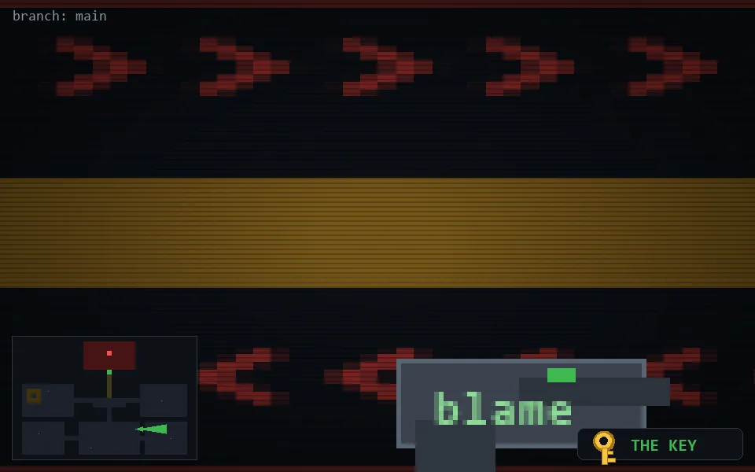

<!-- node:x26y19Ek -->
### `branch: main` · 📍 (26, 19) · facing E · 🔑 THE KEY

|      |      |      |
|:----:|:----:|:----:|
|      | ⛔️ |      |
| [⬅️](x26y19Nk.md) | [💥](x26y19Ekd.md) | [➡️](x26y19Sk.md) |
|      | [⬇️](x25y19Ek.md) |      |

[⌂ index](../README.md)
