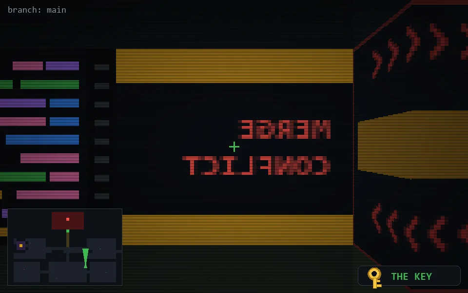

<!-- node:x26y19Nk -->
### `branch: main` · 📍 (26, 19) · facing N · 🔑 LGTM

|      |      |      |
|:----:|:----:|:----:|
|      | [⬆️](x26y18Nk.md) |      |
| [⬅️](x26y19Wk.md) | [💥](x26y19Nk.md) | [➡️](x26y19Ek.md) |
|      | [⬇️](x26y20Nk.md) |      |

[⌂ index](../README.md)
