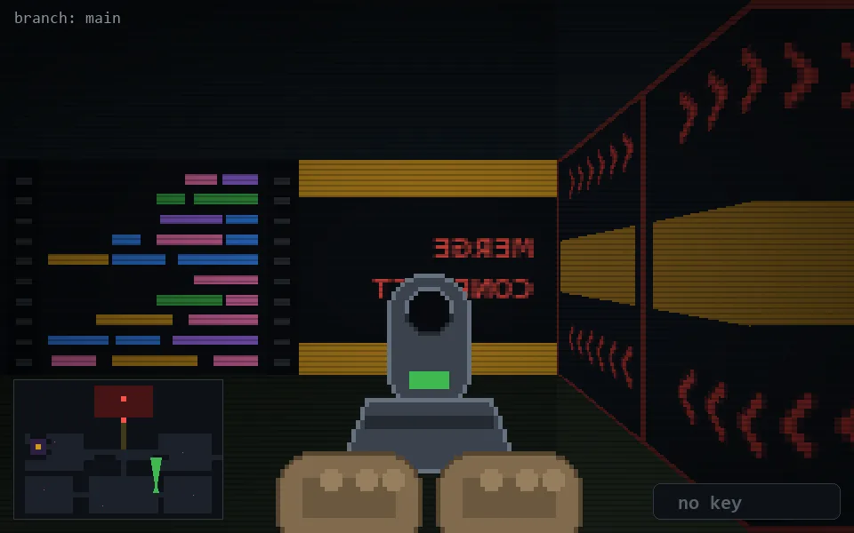

<!-- node:x26y20Nd -->
### `branch: main` · 📍 (26, 20) · facing N · 🔑 — · ✖ bug deleted (it will be back)

|      |      |      |
|:----:|:----:|:----:|
|      | [⬆️](x26y19Nd.md) |      |
| [⬅️](x26y20Wd.md) | [💥](x26y20Nd.md) | [➡️](x26y20Ed.md) |
|      | [⬇️](x26y21Nd.md) |      |

[⌂ index](../README.md)
