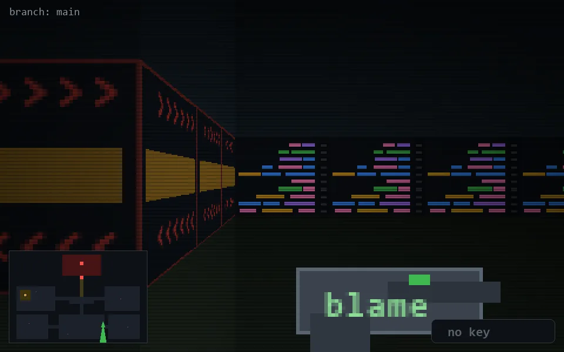

<!-- node:x26y20S -->
### `branch: main` · 📍 (26, 20) · facing S · 🔑 —

|      |      |      |
|:----:|:----:|:----:|
|      | [⬆️](x26y21S.md) |      |
| [⬅️](x26y20E.md) | [💥](x26y20Sd.md) | [➡️](x26y20W.md) |
|      | [⬇️](x26y19S.md) |      |

[⌂ index](../README.md)
